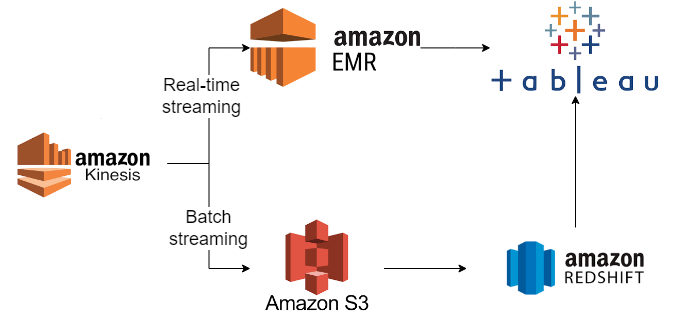

# StackOverflow-data-processor

This project processes the stack overflow data available [here](https://archive.org/download/stackexchange).
It is developed using python 3.9.11

If running locally, SQLite is used as the DB. It can be slow as data grows (depends on your hardware).
In Docker, PostgreSQL is used.

Folder Structure:
```
StackOverflow-data-processor
│   api                     - This contains a simple fastapi that exposes one method to get users data
│   │   app.py              - Entrypoint for FastAPI
│   │   crud.py             - Methods to query db
│   │   requirements.txt    - All libraries needed to run API
│   database                - All SQLite db related functionality
│   │   sql_queries         - Has all the sql queries done to transform raw data to update users table
│   │   connection.py       - Creates connection to SQLite db
│   │   initalization.py    - Creates all tables defined in models.py below
│   │   models.py           - Contains all tables schema including users table schema
│   │   operations          - All db operations are done in this file
│   images                  - Contains images
│   │   production.png      - Potential architecture in production using big data tools
│   schemas                 - Has Pydantic models (or "schemas") to have common attributes while creating or reading data.
│   │   comments.py         - For comments data
│   │   errors.py           - For events where parsing errors occurs like malformed data etc.
│   │   posts.py            - For posts data
│   │   users.py            - For users data
│   tests                   - All tests that are executed using pytest
│   constants.py            - Contains constants shared by different modules
│   docker-compose.yml      - Docker compose file to run the processor and api together with PostgreSQL and pgadmin
│   Dockerfile              - Dockerfile for the processor
│   Dockerfile-API          - Dockerfile for FastAPI
│   download_stacks.py      - Downloads the stacks on StackOverflow
│   file_operations.py      - All file related methods (unzipping, remove etc.)
│   import_helpers.py       - Helper functions to import imput files, queries etc.
│   logging_handlers.py     - Intialize logging handler
│   main.py                 - Entrypoint for the processor that starts reading files and loading data to DB
│   requirements.txt        - All libraries needed to run processor
```

## Build

### Use virtual env (recommended)
```
python -m venv venv
.\venv\Scripts\activate (Windows)
/venv/bin/activate (Unix or MacOS)
```

### Install Dependencies
```
pip install -r requirements.txt
```

## Running Processor
```
python -m main
```

The above will run the processor and process two input files (german.meta.stackexchange.com.7zip, 
french.meta.stackexchange.com.7zip) that are already in the repository. If you want to process
other files then use below command (Note: It will take longer depending on your internet as 
it has to download the files). 

```
python -m main --download-data --stacks french.stackexchange.com.7z german.stackexchange.com.7z  
```

This cleans up the downloaded data after finishing processing so please do not use this command with default 
files mentioned above as they will be deleted.

### Output
The data is stored in SQLite DB in file `sql_app.db` available in the root directory. It contains the `Users` table.

## Running API
The api is in the `api` folder. It has its own `requirements.txt` file. Repeat step above to install
dependencies. Then run it (after running the processor) using:

`python -m api.app`

And go to `http://localhost:8000/docs`

There you can make a get request which returns data in the `Users` table in the db file

## Running in Docker
There is a `docker-compose.yml` to run everything in docker together. 

```commandline
docker-compose down
docker-compose build
docker-compose up 
```

In docker the DB used is PostgreSQL. This is an image which will be downloaded. API is available 
at `http://localhost:8000/docs`

NOTE: This might be slow (depending on your hardware) since all 4 docker containers run at the same time

### Pgadmin4
Additionally, [pgadmin4](https://github.com/postgres/pgadmin4) is also used which the user can go to make
sql queries. After starting go to `http://localhost:5050/`. The login details are:

```commandline
username: admin@admin.org
pass: admin
```

Then add PostgreSQL server.

```commandline
host: db
username: admin
pass: admin
```

Now you can see DB details and do sql queries

## Test project vs Production
This is just a test project. The files are read line-by-line to simulate "stream events". Data 
is stored in tables, and then later transformed in SQL and updated in `users` table with total
posts and avg comments per user. Other tools like Spark or Pandas were viable alternatives
but with big data databases (E.g, MPP database like Redshift) SQL is quite fast and no transfer 
of data across network is needed. Of course, it depends on the use case.

If a "stream event" is malformed (or other errors) then these events are stored in a `parsing_errors` 
table.

In production the architecture could like below. Assuming we need to have real time
data as well (to update dashboards) as well as store transformed data in DWH to gain more
business insights from it.

